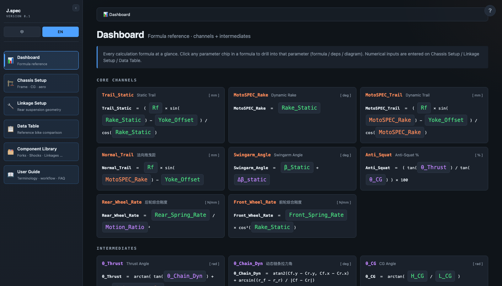
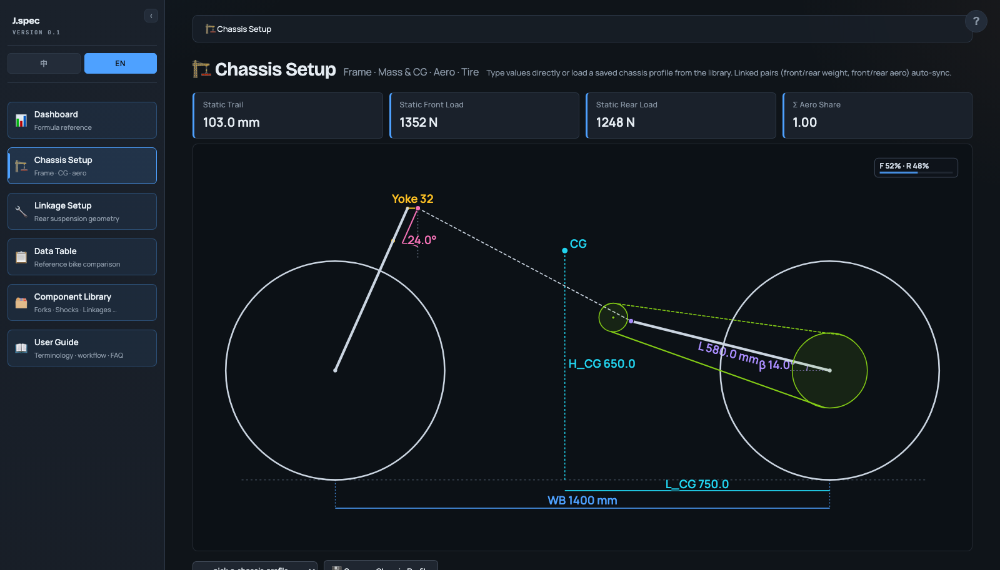
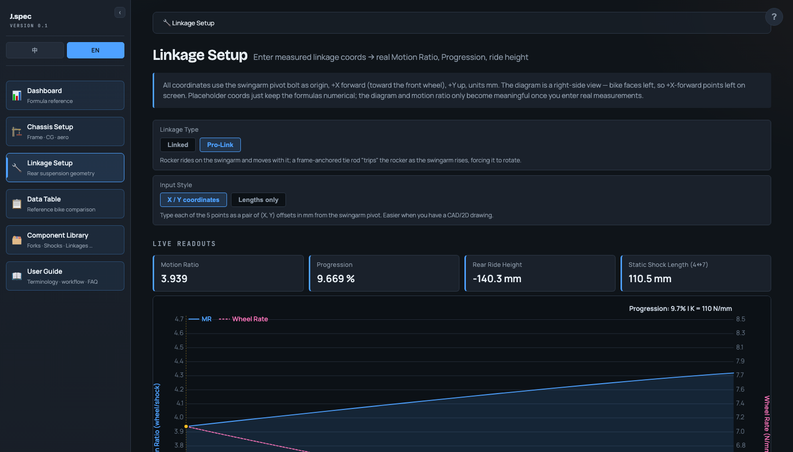
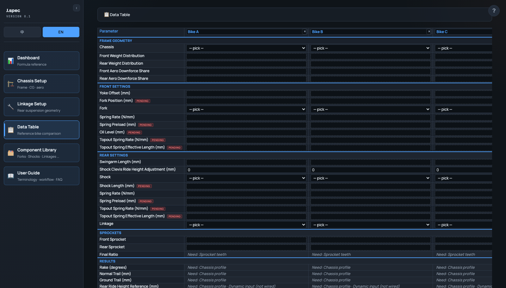
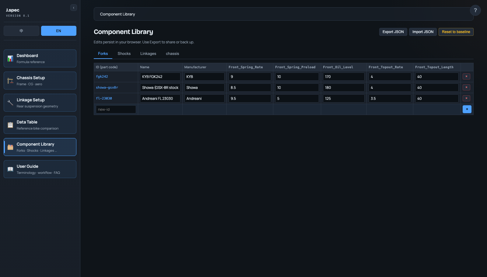

# MotoSPEC Formula Explorer

A static, single-page motorcycle chassis geometry calculator. Explore parameter
chains for trail and rake, solve 4-bar rear-linkage kinematics, and compare
reference bikes side-by-side. Bilingual UI (中文 / English).

No bundler, no build step — plain ES modules served over HTTP.



## Run it locally

### Windows — 双击即用 / double-click exe

Download [`MotoSPEC.exe`](https://github.com/cyprien0312/motospec/raw/main/MotoSPEC.exe)
(≈340 KB, no install, nothing else required) and double-click it. It starts a
local server on `127.0.0.1` and opens the app in your default browser; close
the console window to quit. Windows SmartScreen may warn because the exe is
unsigned — click "More info → Run anyway" (更多信息 → 仍要运行).

The exe embeds the whole app; it is rebuilt from source by
[`windows-launcher/build.ps1`](windows-launcher/build.ps1) using the C#
compiler that ships with Windows (no SDK needed).

### Any OS — serve the repo

Requires **Node 22+** (for JSON Import Attributes and the built-in test runner).

```bash
# Serve the repo root with any static file server
python3 -m http.server 8000
# then open http://localhost:8000
```

`index.html` imports modules from `./src/`, so it must be served — opening the
file directly via `file://` will not work.

## Run the tests

```bash
npm test                                          # all tests
node --test tests/linkage.test.js                 # one file
node --test --test-name-pattern='pro-link' tests/ # by name
```

`tests/validation.test.js` is the reference-bike parity harness — it diffs
computed output against published spec-sheet numbers (R6, CBR1000RR,
Panigale V4) with a per-bike mm tolerance.

## What's inside

### Chassis Setup — frame geometry, mass + CG, aero, tire

Auto-fitting side-view diagram driven by your `WB` and `Rf`. Save / load
chassis profiles to the chassis catalog.



### Linkage Setup — 4-bar rear suspension

Two modes (`linked`, `pro-link`) sharing one Newton-Raphson closure solver.
Two input styles: Cartesian XY, or lengths-only via chained two-circle
intersections. Live motion-ratio + wheel-rate chart through the stroke.



### Data Table — variable bike-column comparison

Up to 5 bike columns. Pick a chassis profile and components to materialize a
bike's input dict. RESULTS cells render real numbers when their leaf inputs
are bound, otherwise blank with a "Need: …" hint naming the missing provider.



### Component Library — four catalogs

Chassis / forks / shocks / linkages. Baseline JSON ⊕ user overlay
(localStorage), with import / export / reset.



### Plus

- **Dashboard** — formula reference with drill-down on every parameter chip.
- **User Guide** — bilingual long-form help with a per-page `?` shortcut.

## Repository layout

```
index.html               UI shell, styles, DOM wiring
src/
  formulas.js            Pure parameter graph (P, INPUT_META, CALC, TOPO_ORDER)
  linkage.js             4-bar linkage closure kernel
  linkage-setup.js       Linkage editor page
  chassis-setup.js       Chassis editor page
  data-table.js          Reference-bike comparison
  reference-bikes.js     Default seed columns + COMMON_ENV
  catalog.js             Baseline ⊕ overlay catalog system
  catalog-editor.js      Component Library page
  user-guide.js          Bilingual help renderer
data/*.json              Baseline catalog entries
tests/                   Node built-in test runner
docs/                    Research notes (linkage coords, mind-maps)
```

## Conventions

- `src/formulas.js` and `src/linkage.js` are **pure** — no DOM, no i18n, no
  side effects. Tests import them directly. Keep it that way.
- All units are mm and degrees unless explicitly converted (`D2R` / `R2D`).
- Inline `onclick` handlers are intentional. New handler functions must be
  re-exposed via the `Object.assign(window, {...})` block in `index.html`,
  or the button silently does nothing.
- The pro-link rocker rides the swingarm. It's implemented as the linked
  closure with β negated — working in the swingarm's rotating frame. Don't
  fork the solver.

See [`CLAUDE.md`](./CLAUDE.md) for the long-form architecture notes and
[`CHANGELOG.md`](./CHANGELOG.md) for what's in v0.1.

## Status

v0.1 — the static-snapshot path is feature-complete. Dynamic load
(weight-transfer driven readings) is the next milestone; those rows are
currently omitted from the Data Table rather than rendered with placeholder
math.

## License

No license file yet — treat as source-available, all rights reserved until
one is added. Open an issue if you'd like to use it.
