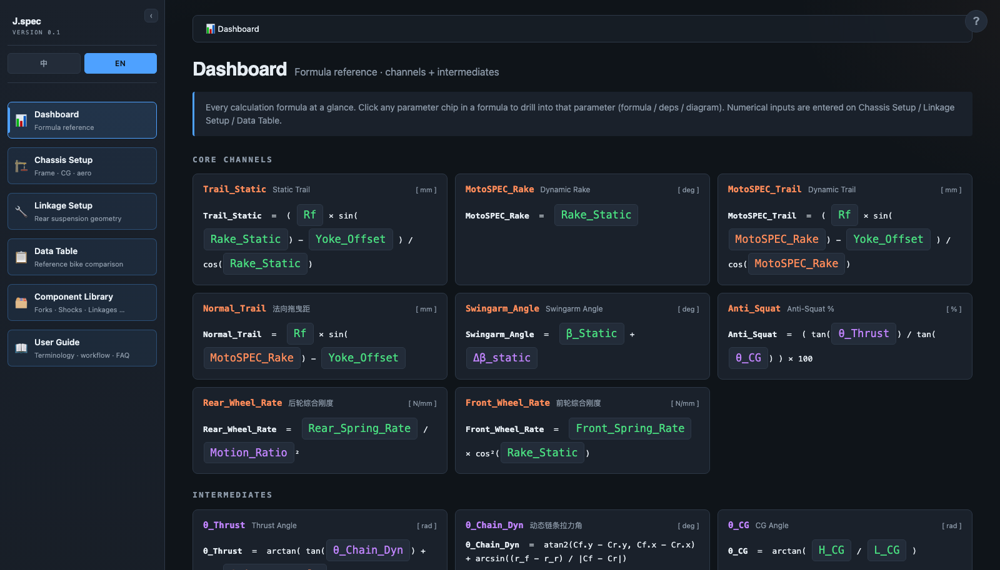
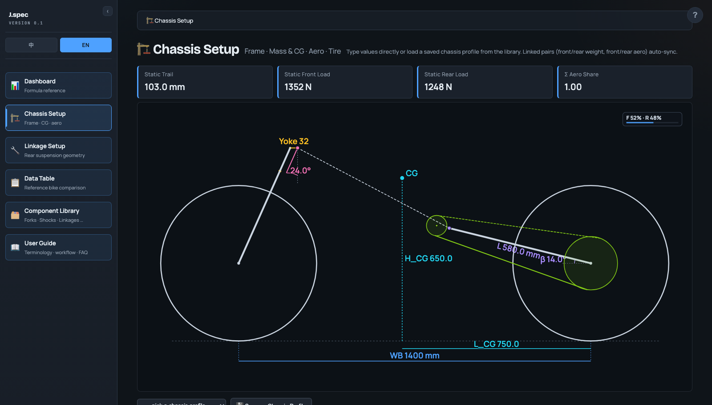
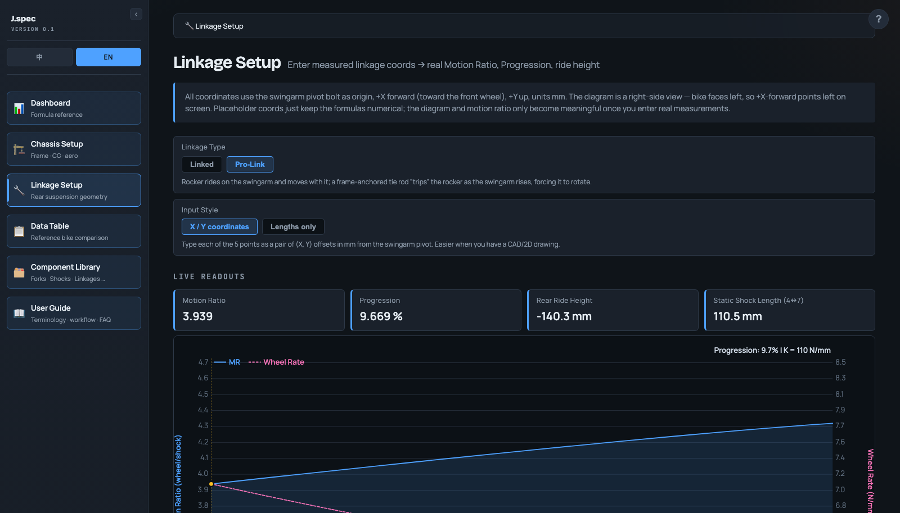
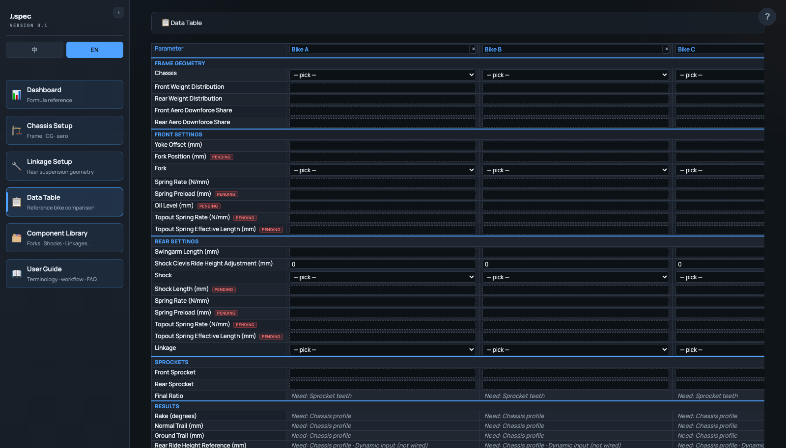
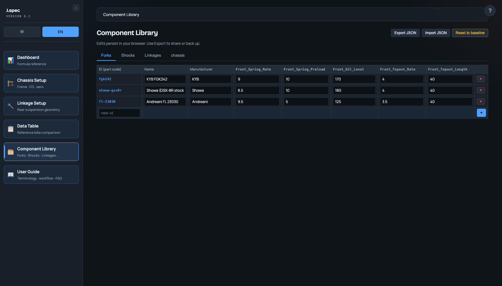

# MotoSPEC Formula Explorer

A static, single-page motorcycle chassis geometry calculator. Explore parameter
chains for trail and rake, solve 4-bar rear-linkage kinematics, and compare
reference bikes side-by-side. Bilingual UI (中文 / English).

No bundler, no build step — plain ES modules served over HTTP.



## Run it locally

### Windows — 双击即用 / double-click exe

Download [`MotoSPEC.exe`](https://github.com/cyprien0312/motospec/raw/main/MotoSPEC.exe)
(≈340 KB, no install, nothing else required) and double-click it. It starts a
local server on `127.0.0.1` and opens the app in your default browser; close
the console window to quit. Windows SmartScreen may warn because the exe is
unsigned — click "More info → Run anyway" (更多信息 → 仍要运行).

The exe embeds the whole app; it is rebuilt from source by
[`windows-launcher/build.ps1`](windows-launcher/build.ps1) using the C#
compiler that ships with Windows (no SDK needed).

### Any OS — serve the repo

Requires **Node 22+** (for JSON Import Attributes and the built-in test runner).

```bash
# Serve the repo root with any static file server
python3 -m http.server 8000
# then open http://localhost:8000
```

`index.html` imports modules from `./src/`, so it must be served — opening the
file directly via `file://` will not work.

## Run the tests

```bash
npm test                                                      # all tests
node --test tests/linkage.test.js                             # one file
node --test --test-name-pattern='pro-link' tests/linkage.test.js  # by name
```

Do **not** pass a bare directory (`node --test tests/`) — newer Node 22 rejects
it. Bare `node --test` already discovers `tests/**/*.test.js`.

`tests/validation.test.js` is the reference-bike parity harness — it diffs
computed output against published spec-sheet numbers (R6, CBR1000RR,
Panigale V4) with a per-bike mm tolerance.

## What's inside

### Chassis Setup — frame geometry, mass + CG, aero, tire

Auto-fitting side-view diagram driven by your `WB` and `Rf`. Save / load
chassis profiles to the chassis catalog.



### Linkage Setup — rear suspension kinematics

Three modes: `linked` and `pro-link` share one Newton-Raphson 4-bar closure
solver, while `linkless` (Direct — Yamaha R3, KTM 890/990 Duke) bolts the shock
straight to the swingarm and needs no closure at all. Two input styles:
Cartesian XY, or lengths-only via chained two-circle intersections. Live
motion-ratio + wheel-rate chart through the stroke. An unconverged closure
poisons downstream numbers to NaN and renders as "—" rather than a plausible
fake.



### Data Table — variable bike-column comparison

Up to 5 bike columns. Pick a chassis profile and components to materialize a
bike's input dict. RESULTS cells render real numbers when their leaf inputs
are bound, otherwise blank with a "Need: …" hint naming the missing provider.



### Component Library — four catalogs

Chassis / forks / shocks / linkages. Baseline JSON ⊕ user overlay
(localStorage), with import / export / reset.



### Setup sensitivity map — `Δ sens` per column

There is no universal "good" rake or trail number. What transfers is *this*
bike's sensitivity: what one real-world click of each adjuster (fork position,
yoke offset, chain adjuster, shock length, tyre radius, spring rates) does to
every metric. Central differences through the bike's own parameter graph at its
current setup, in a printable page you can take to the paddock. Anything whose
inputs aren't truly bound shows "—" instead of a number.

### Data-acquisition export — `⤓ logger` per column

Bakes a column's geometry into paste-ready math channels for **MoTeC i2** and
**AiM RS3**, plus a directly-importable `.ajmc` file and a CSV lookup table.
The linkage nonlinearity (shock pot → rear wheel travel) is sampled through the
4-bar solver and polynomial-fitted, with the max residual and the valid domain
printed in the export header. Anti-Squat / CofG and Wheel Force channels are
deliberately **not** generated — they'd need a measured CG and an air-spring /
preload model respectively. Format notes: [`dataacq/README.md`](dataacq/README.md).

### Plus

- **Dashboard** — formula reference with drill-down on every parameter chip.
- **CG calculator** — two-condition scale method, inside the Chassis Setup page;
  writes `H_CG` / `L_CG`. Returns `null` with a warning code rather than a
  partial guess when the readings don't determine an answer.
- **User Guide** — bilingual long-form help with a per-page `?` shortcut,
  including a "what this tool does *not* compute" section.

## Repository layout

```
index.html               UI shell, styles, DOM wiring
src/
  formulas.js            Pure parameter graph (P, INPUT_META, CALC, TOPO_ORDER)
  linkage.js             4-bar linkage closure kernel (+ linkless path)
  linkage-setup.js       Linkage editor page
  chassis-setup.js       Chassis editor page
  cg-calculator.js       Centre-of-gravity solver (rendered inside Chassis Setup)
  data-table.js          Reference-bike comparison + readiness rules
  sensitivity.js         Per-bike setup sensitivity map (pure)
  logger-export.js       MoTeC i2 / AiM RS3 math-channel generator (pure)
  reference-bikes.js     Default seed columns + COMMON_ENV
  catalog.js             Baseline ⊕ remote ⊕ overlay catalog system
  catalog-editor.js      Component Library page
  supabase.js            Dependency-free PostgREST client (shared library)
  user-guide.js          Bilingual help renderer
data/*.json              Baseline catalog entries
tests/                   Node built-in test runner
docs/                    Documentation index — start at docs/README.md;
                         docs/LIMITATIONS.md is the model-boundary audit
dataacq/                 Logger format notes (samples/ gitignored)
scan/                    3D scan → chassis/linkage hardpoints (Python, separate)
windows-launcher/        C# source + build script for MotoSPEC.exe
```

## Conventions

- `src/formulas.js` and `src/linkage.js` are **pure** — no DOM, no i18n, no
  side effects. Tests import them directly. Keep it that way.
- All units are mm and degrees unless explicitly converted (`D2R` / `R2D`).
- Inline `onclick` handlers are intentional. New handler functions must be
  re-exposed via the `Object.assign(window, {...})` block in `index.html`,
  or the button silently does nothing.
- The pro-link rocker rides the swingarm. It's implemented as the linked
  closure with β negated — working in the swingarm's rotating frame. Don't
  fork the solver.

See [`CLAUDE.md`](./CLAUDE.md) for the long-form architecture notes and
[`CHANGELOG.md`](./CHANGELOG.md) for what's in v0.1.

## Status

v0.1 — the static-snapshot path is feature-complete, and a **sag load case**
now drives every RESULTS row live (rake / trail / swingarm angle / motion ratio
/ wheelbase all respond to sag and to fork and shock geometry deltas; at zero
sag everything degenerates exactly to static). Fully time-domain dynamics
(damping, weight-transfer driven readings) remain out of scope.

Model boundaries are documented rather than papered over: see
[`docs/LIMITATIONS.md`](docs/LIMITATIONS.md) for the engineering-side audit
(what isn't modelled, how uncertain the source data is, and which limits are
deliberate vs. pending vs. impossible) and the "what this tool does not
compute" section of the in-app user guide for the reader-facing version. When a
value can't be honestly derived, the cell is blank with a "Need: …" hint — a
blank is the tool saying it doesn't know, not a bug.

## License

No license file yet — treat as source-available, all rights reserved until
one is added. Open an issue if you'd like to use it.
