# MotoSPEC 静态参数金字塔 / Static Channel Mind Map

> **Scope**: 仅静态数据 (static-only). 与动态行驶相关的输入和通道 (Travel_Front / Travel_Rear / a_x / V / Lean_Angle / Pitch / Δβ / MotoSPEC_Rake / MotoSPEC_Trail / MotoSPEC_SwgarmAngl / theta_chain_dynamic / theta_thrust / delta_W / F_Aero / MotoSPEC_AntSquat / MotoSPEC_FrontForce / MotoSPEC_RearForce) 不在此图中。

## 颜色图例 (Legend)

- 🔴 **红色 — 车架/结构固定，不可调** (frame geometry, sprocket mounting points, head-tube rake)
- 🔵 **蓝色 — 用户可调** (fork height, swingarm length, shock length, springs, preload, sprocket teeth, ride-height adjuster…)
- 🟢 **绿色 — 其他** (rider mass、CG、tire radius、aero、weight distribution、chain pitch…)

---

## 金字塔结构 (Pyramid, top → bottom: channel → intermediate → input)

```mermaid
flowchart TD
    %% ===== Top tier: final static channels =====
    Trail_Static["⭐ Trail_Static<br/>静态拖曳距 (mm)"]:::channel
    O_node["⭐ O — Offset<br/>转向轴偏移 (mm)"]:::channel
    Final_Ratio["⭐ Final_Ratio<br/>最终传动比"]:::channel
    Motion_Ratio["⭐ Motion_Ratio<br/>运动比 (轮/避震)"]:::channel
    Progression["⭐ Progression<br/>渐进性 %"]:::channel
    Rear_Ride_Height["⭐ Rear_Ride_Height<br/>后部车高参考 (mm)"]:::channel
    Rear_Wheel_Rate["⭐ Rear_Wheel_Rate<br/>后轮综合刚度 (N/mm)"]:::channel
    Front_Wheel_Rate["⭐ Front_Wheel_Rate<br/>前轮综合刚度 (N/mm)"]:::channel
    W_F_Static["⭐ W_F_Static<br/>前轮静态受力 (N)"]:::channel
    W_R_Static["⭐ W_R_Static<br/>后轮静态受力 (N)"]:::channel

    %% ===== Middle tier: intermediates =====
    %% (O is itself an intermediate that also functions as a top-level offset channel)

    %% ===== Bottom tier: inputs =====
    %% Frame-fixed (red)
    Rake_Static[Rake_Static<br/>静态后倾角]:::fixed
    Frame_Rocker_Pivot_X[Frame_Rocker_Pivot_X]:::fixed
    Frame_Rocker_Pivot_Y[Frame_Rocker_Pivot_Y]:::fixed
    Rocker_To_Shock_X[Rocker_To_Shock_X]:::fixed
    Rocker_To_Shock_Y[Rocker_To_Shock_Y]:::fixed
    Rocker_To_Drag_X[Rocker_To_Drag_X]:::fixed
    Rocker_To_Drag_Y[Rocker_To_Drag_Y]:::fixed
    Drag_To_Swingarm_X[Drag_To_Swingarm_X]:::fixed
    Drag_To_Swingarm_Y[Drag_To_Swingarm_Y]:::fixed
    Frame_Shock_Top_X[Frame_Shock_Top_X]:::fixed
    Frame_Shock_Top_Y[Frame_Shock_Top_Y]:::fixed
    Front_Sprocket_X[Front_Sprocket_X<br/>前链轮中心X]:::fixed
    Front_Sprocket_Y[Front_Sprocket_Y<br/>前链轮中心Y]:::fixed

    %% User-adjustable (blue)
    WB[WB<br/>轴距]:::adj
    Yoke_Offset[Yoke_Offset<br/>三星台偏移]:::adj
    Fork_Position[Fork_Position<br/>前叉伸出量]:::adj
    Front_Spring_Rate[Front_Spring_Rate]:::adj
    Front_Spring_Preload[Front_Spring_Preload]:::adj
    Front_Oil_Level[Front_Oil_Level]:::adj
    Front_Topout_Rate[Front_Topout_Rate]:::adj
    Front_Topout_Length[Front_Topout_Length]:::adj
    Swingarm_Length[Swingarm_Length<br/>摇臂长度]:::adj
    L_SA[L_SA<br/>摇臂有效长度]:::adj
    beta_static[β_static<br/>静态摇臂角度]:::adj
    Shock_Length[Shock_Length<br/>后避震长度]:::adj
    Shock_Clevis_RHA[Shock_Clevis_RHA<br/>后避震车高调整]:::adj
    Rear_Spring_Rate[Rear_Spring_Rate]:::adj
    Rear_Spring_Preload[Rear_Spring_Preload]:::adj
    Rear_Topout_Rate[Rear_Topout_Rate]:::adj
    Rear_Topout_Length[Rear_Topout_Length]:::adj
    Front_Sprocket[Front_Sprocket<br/>前链轮齿数]:::adj
    Rear_Sprocket[Rear_Sprocket<br/>后链轮齿数]:::adj

    %% Other (green)
    Rf[Rf<br/>前轮滚动半径]:::other
    Mass[Mass<br/>人车总质量]:::other
    H_CG[H_CG<br/>重心高度]:::other
    L_CG[L_CG<br/>重心到后轴距离]:::other
    front_weight_dist[front_weight_dist]:::other
    rear_weight_dist[rear_weight_dist]:::other
    Chain_Pitch[Chain_Pitch<br/>链节距]:::other

    %% ===== Edges: channel ← inputs/intermediates =====
    Trail_Static --> Rf
    Trail_Static --> Rake_Static
    Trail_Static --> O_node
    O_node --> Yoke_Offset

    Final_Ratio --> Front_Sprocket
    Final_Ratio --> Rear_Sprocket

    %% Linkage-derived channels share the same 4-bar geometry inputs
    Motion_Ratio --> Frame_Rocker_Pivot_X
    Motion_Ratio --> Frame_Rocker_Pivot_Y
    Motion_Ratio --> Rocker_To_Shock_X
    Motion_Ratio --> Rocker_To_Shock_Y
    Motion_Ratio --> Rocker_To_Drag_X
    Motion_Ratio --> Rocker_To_Drag_Y
    Motion_Ratio --> Drag_To_Swingarm_X
    Motion_Ratio --> Drag_To_Swingarm_Y
    Motion_Ratio --> Frame_Shock_Top_X
    Motion_Ratio --> Frame_Shock_Top_Y
    Motion_Ratio --> Swingarm_Length
    Motion_Ratio --> beta_static

    Progression --> Frame_Rocker_Pivot_X
    Progression --> Frame_Rocker_Pivot_Y
    Progression --> Rocker_To_Shock_X
    Progression --> Rocker_To_Shock_Y
    Progression --> Rocker_To_Drag_X
    Progression --> Rocker_To_Drag_Y
    Progression --> Drag_To_Swingarm_X
    Progression --> Drag_To_Swingarm_Y
    Progression --> Frame_Shock_Top_X
    Progression --> Frame_Shock_Top_Y
    Progression --> Swingarm_Length
    Progression --> beta_static

    Rear_Ride_Height --> Frame_Rocker_Pivot_X
    Rear_Ride_Height --> Frame_Rocker_Pivot_Y
    Rear_Ride_Height --> Rocker_To_Shock_X
    Rear_Ride_Height --> Rocker_To_Shock_Y
    Rear_Ride_Height --> Rocker_To_Drag_X
    Rear_Ride_Height --> Rocker_To_Drag_Y
    Rear_Ride_Height --> Drag_To_Swingarm_X
    Rear_Ride_Height --> Drag_To_Swingarm_Y
    Rear_Ride_Height --> Frame_Shock_Top_X
    Rear_Ride_Height --> Frame_Shock_Top_Y
    Rear_Ride_Height --> Swingarm_Length
    Rear_Ride_Height --> beta_static
    Rear_Ride_Height --> Shock_Clevis_RHA

    Rear_Wheel_Rate --> Rear_Spring_Rate
    Rear_Wheel_Rate --> Rear_Spring_Preload
    Rear_Wheel_Rate --> Rear_Topout_Rate
    Rear_Wheel_Rate --> Rear_Topout_Length
    Rear_Wheel_Rate --> Shock_Length
    Rear_Wheel_Rate --> Motion_Ratio

    Front_Wheel_Rate --> Front_Spring_Rate
    Front_Wheel_Rate --> Front_Spring_Preload
    Front_Wheel_Rate --> Front_Oil_Level
    Front_Wheel_Rate --> Front_Topout_Rate
    Front_Wheel_Rate --> Front_Topout_Length
    Front_Wheel_Rate --> Fork_Position

    W_F_Static --> Mass
    W_F_Static --> front_weight_dist
    W_R_Static --> Mass
    W_R_Static --> rear_weight_dist

    %% Chain pitch hangs off Final_Ratio's geometry siblings (used in dynamic chain angle, but kept here as a bottom input reference)
    Final_Ratio -.-> Chain_Pitch

    %% Trail_Static / channels also reference WB, H_CG, L_CG indirectly via dynamic siblings; for the static map we surface them as side inputs:
    classDef channel fill:#fff7d6,stroke:#b8860b,stroke-width:2px,color:#5a4500;
    classDef fixed   fill:#ffe0e0,stroke:#c0392b,stroke-width:1.5px,color:#7a1e15;
    classDef adj     fill:#dceeff,stroke:#1f6fbf,stroke-width:1.5px,color:#0e3a66;
    classDef other   fill:#d8f0d8,stroke:#2e7d32,stroke-width:1.5px,color:#1b4d1f;
```

---

## 表格速查 (Tabular reference)

### 顶层 — 静态通道 (Top: static channels)

| Channel | Unit | 说明 |
|---|---|---|
| `Trail_Static` | mm | 静态拖曳距 |
| `O` | mm | 转向轴偏移 (= Yoke_Offset) |
| `Final_Ratio` | — | 后/前链轮齿数比 |
| `Motion_Ratio` | — | 后轮位移 / 避震行程 (静态点) |
| `Progression` | % | 后悬挂渐进性 |
| `Rear_Ride_Height` | mm | 后部车高参考 |
| `Rear_Wheel_Rate` | N/mm | 后轮综合刚度 |
| `Front_Wheel_Rate` | N/mm | 前轮综合刚度 |
| `W_F_Static` | N | 前轮静态受力 |
| `W_R_Static` | N | 后轮静态受力 |

### 中层 — 中间值 (Middle: intermediates / sub-channels)

| Node | Used by | 说明 |
|---|---|---|
| `O` (offset) | Trail_Static | = `Yoke_Offset`（轮芯偏移按 0 处理） |
| `Motion_Ratio` | Rear_Wheel_Rate | 4-bar 闭合静态点 |

(其他动态中间量 Pitch / Δβ / θ_thrust / θ_CG / ΔW / F_Aero 因含动态输入，已排除。)

### 底层 — 输入分类 (Bottom: inputs by colour)

#### 🔴 不可调 (frame-fixed)

| Input | 说明 |
|---|---|
| `Rake_Static` | 车架转向头管角度 |
| `Frame_Rocker_Pivot_X/Y` | 摇臂枢轴坐标 |
| `Rocker_To_Shock_X/Y` | 摇臂→避震连接点 |
| `Rocker_To_Drag_X/Y` | 摇臂→拉杆连接点 |
| `Drag_To_Swingarm_X/Y` | 拉杆→摇臂连接点 |
| `Frame_Shock_Top_X/Y` | 车架避震顶部连接点 |
| `Front_Sprocket_X/Y` | 前链轮中心坐标 (车架固定) |

#### 🔵 可调 (user-adjustable)

| Input | 调节方式 |
|---|---|
| `WB` | 由 `Swingarm_Length` + `beta_static` + 链条调整 + 前叉伸出量共同决定，可调 |
| `Yoke_Offset` | 三星台偏移更换 |
| `Fork_Position` | 前叉在三星台中的伸出量 |
| `Front_Spring_Rate` / `Front_Spring_Preload` / `Front_Oil_Level` | 前叉内部 setup |
| `Front_Topout_Rate` / `Front_Topout_Length` | 前叉回顶弹簧 |
| `Swingarm_Length` / `L_SA` | 摇臂更换或加长 |
| `beta_static` | 通过车高调整器/避震长度调整 |
| `Shock_Length` | 避震眼对眼总长 |
| `Shock_Clevis_RHA` | Clevis 车高调整 |
| `Rear_Spring_Rate` / `Rear_Spring_Preload` | 后避震 setup |
| `Rear_Topout_Rate` / `Rear_Topout_Length` | 后避震回顶 |
| `Front_Sprocket` / `Rear_Sprocket` | 前/后链轮齿数（更换） |

#### 🟢 其他 (rider / environment / spec)

| Input | 类别 |
|---|---|
| `Rf` | 轮胎规格 |
| `Mass` | 人车总质量 |
| `H_CG` / `L_CG` | 重心位置 (实测) |
| `front_weight_dist` / `rear_weight_dist` | 静态重量分配 |
| `Chain_Pitch` | 链条规格 (520/525/530 = 15.875 mm) |

---

## 备注 (Notes)

- `Motion_Ratio`、`Progression`、`Rear_Ride_Height`、`Rear_Wheel_Rate`、`Front_Wheel_Rate` 在 Phase C 完成前部分仍为占位/NaN — 见 `src/formulas.js` 中的 `CALC` 表。
- `beta_static` 与 `Swingarm_Length` 标为蓝色：在大多数车型上它们是通过更换摇臂或调整车高来改变的，而非"出厂死值"。如果需要在某具体车型上锁死它们，请视为红色。
- `Rake_Static`：少数车型（带可调头管 / 偏心套）可调，但默认按"红色不可调"处理。
- 完整的依赖图（含动态链路）请直接参考 `src/formulas.js` 中每个节点的 `deps` 字段。
